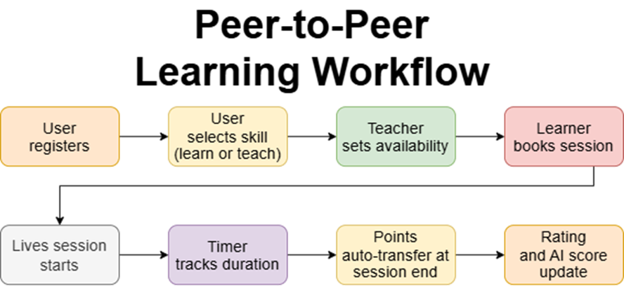

# Peer-to-Peer Learning platform

The Peer-to-Peer Learning Platform is a live, time-based knowledge exchange system that enables users to both learn and teach skills without monetary transactions.
The platform is designed to solve a key problem:
Many students cannot afford paid online courses, while many skilled individuals want to share knowledge but lack accessible opportunities.
This platform creates a credit-based learning economy, where users earn points by teaching and spend points to learn from others.

 The system supports:

- One-to-one live sessions
- Real-time point transactions
- AI-based skill validation
- Reputation-based ranking

The platform is open to students, professionals, and lifelong learners.

## Features

- Live one-to-one sessions
- Time-based credit system
- AI-based skill validation
- Rating and reputation system

## Workflow

<!-- ## Future Enhancements

- Group sessions
- Mobile application
- Skill certification badges
- Blockchain-based credit tracking
- Premium mentorship tiers
- Corporate learning programs -->

## Impact

- Removes financial barriers to education.
- Encourages collaborative learning.
- Rewards knowledge sharing.
- Builds community-driven growth.

 The Peer-to-Peer Learning Platform introduces a sustainable, AI-enhanced, time-based learning economy. By eliminating direct monetary transactions and enabling skill exchange, the system empowers learners and educators equally.

## 🤝 Contributing

Pull requests and ideas are welcome.

## Author

- Bilal Shaikh
- Github:- [https://github.com/bilalshaikh-code](https://github.com/bilalshaikh-code)
